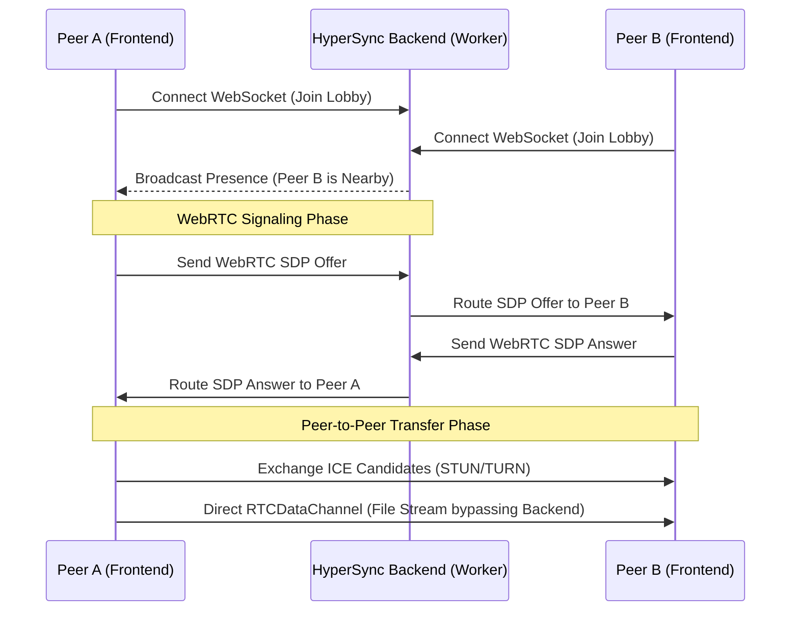

<div align="center">
  
  <h1>HyperSync Frontend</h1>
</div>

---

<div align="center">
  <strong>HyperSync is a blazingly fast, peer-to-peer file transfer application built with modern web technologies. This repository contains the frontend client.</strong><br>
  <em>Looking for the signaling server? Check out the <a href="https://github.com/mosabbir-maruf/HyperSync-Backend">HyperSync Backend</a>.</em>
</div>

---

## Features

- ⚡ **Blazing Fast**: Direct peer-to-peer WebRTC file transfers bypassing server bottlenecks.
- 🔒 **Secure & Private**: Files are encrypted end-to-end via WebRTC; the backend never sees your data.
- ♾️ **No File Size Limits**: Stream massive files directly between browsers.
- 👥 **Group Sharing**: Share files seamlessly with multiple peers simultaneously in group rooms.
- 🎨 **Modern UI**: Clean, responsive interface built with React 19 and Tailwind CSS v4.

## Prerequisites

- [Node.js](https://nodejs.org/) (v18 or newer)
- npm or yarn

## Local Development

1. **Clone the repository:**
   ```bash
   git clone https://github.com/mosabbir-maruf/HyperSync.git
   cd HyperSync
   ```

2. **Install dependencies:**
   ```bash
   npm install
   ```

3. **Set up environment variables:**
   Create a `.env.local` file based on the environment section below.

4. **Start the development server:**
   ```bash
   npm run dev
   ```
   The app will be available at `http://localhost:8443` (or the port specified in your console).

## Architecture

The frontend is a Single Page Application (SPA) built with:
- **React** (v19)
- **Vite** (Build Tool)
- **Tailwind CSS** (v4 for styling)
- **WebRTC** (For peer-to-peer data transfer)
- **WebSockets** (For signaling via the Cloudflare Worker backend)

## System Workflow



1. **Signaling**: When you open the application, it establishes a secure WebSocket connection to the HyperSync Cloudflare Worker backend.
2. **Presence & Lobbies**: The backend tracks active devices (using Durable Objects) and broadcasts presence information (e.g. "Nearby Devices").
3. **WebRTC Peer-to-Peer**: When you select a device to transfer a file:
   - The frontend generates an SDP offer.
   - The offer is routed through the WebSocket signaling server to the peer.
   - The peer responds with an SDP answer.
   - ICE candidates (STUN/TURN) are exchanged to punch through NATs.
   - A direct, encrypted WebRTC `RTCDataChannel` is established.
4. **Data Transfer**: Files are chunked and streamed directly from browser to browser. The backend is completely bypassed during the actual file transfer, ensuring maximum privacy and speed without server bandwidth limits.

## Environment Variables

Create a `.env.production` or `.env.local` file in the root of the `frontend` directory based on this example:

```env
# URL of the HyperSync Cloudflare Worker backend
VITE_WS_URL=https://your-worker-url.workers.dev
```

## File Structure

```text
HyperSync-Frontend/
├── public/                 # Static assets (Favicons, OG Images)
│   └── avatars/            # Marvel hero avatar library
├── src/                    
│   ├── components/         # React components
│   │   ├── layout/         # Shell, ThemeToggle, Navigation
│   │   ├── messaging/      # Chat UI and message bubbles
│   │   ├── session/        # Peer cards, Drop zones, Radar view
│   │   └── ui/             # Reusable primitive UI components
│   ├── lib/                # Core business logic
│   │   ├── signaling/      # WebSocket client and presence
│   │   └── transfer/       # WebRTC chunking and file transfer managers
│   ├── routes/             # Page components (Home, History, Settings)
│   └── state/              # React Context providers (Global State)
├── index.html              # HTML Entry Point
├── package.json            # Dependencies and scripts
├── tsconfig.json           # TypeScript configuration
└── vite.config.ts          # Vite build configuration
```

## Deployment Guide (Cloudflare Pages)

1. Push this repository to GitHub.
2. Log into your [Cloudflare Dashboard](https://dash.cloudflare.com/).
3. Navigate to **Workers & Pages** -> **Pages**.
4. Click **Connect to Git** and select this repository (`HyperSync`).
5. Configure the build settings:
   - **Framework preset**: `Vite` (or `None` if Vite is not listed)
   - **Build command**: `npm run build`
   - **Build output directory**: `dist`
   - **Root directory**: `/` (Leave as is)
6. Under **Environment variables (advanced)**, click Add variable:
   - **Variable name**: `VITE_WS_URL`
   - **Value**: The live URL of your deployed Worker backend (e.g. `https://ws-hypersync.yourdomain.workers.dev`)
7. Click **Save and Deploy**.
